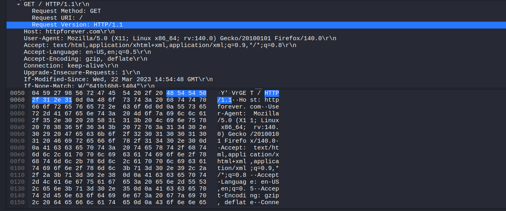
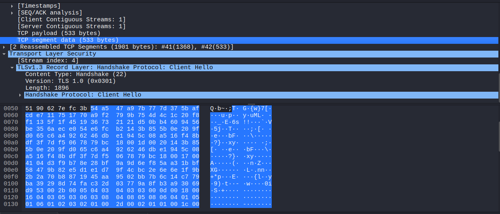
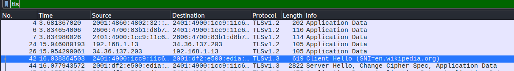
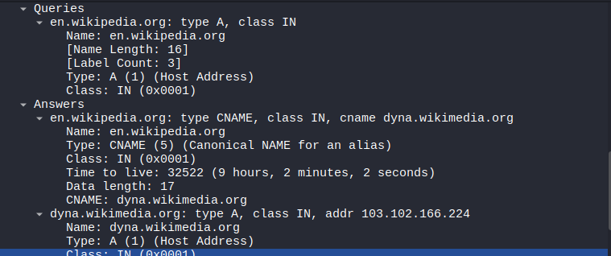
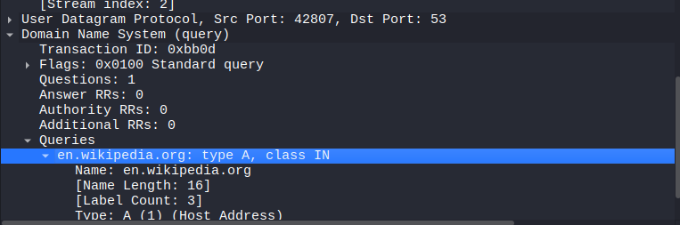

# Network Traffic Analysis – Observations

## Overview
Basic network traffic was captured using **Wireshark on Kali Linux** to become familiar with protocol-based filters and to visually analyze how different network protocols behave in a real-time environment.

The analysis focuses on **HTTP, HTTPS, and DNS** traffic to understand data visibility, encryption, and protocol behavior from a security perspective.

---

## Sections
- [HTTP](#http)
- [HTTPS](#https)
- [DNS](#dns)

---

## HTTP

**Website used to generate traffic:**  
http://www.httpforever.com/

HTTP (Hypertext Transfer Protocol) is an **application-layer protocol** that does not provide built-in security mechanisms such as encryption or authentication. Data transmitted over HTTP is sent in **plaintext**, making it vulnerable to interception.

### Packet Analysis

### Observations
- Readable HTTP headers such as `GET`, `Host`, and `User-Agent` are visible.
- Both request metadata and payload are transmitted in plaintext.
- Any sensitive information submitted over HTTP (e.g., form data) can be intercepted through packet sniffing.

### Security Implication
HTTP traffic exposes sensitive information and should not be used for transmitting confidential data. This demonstrates why HTTPS is required for secure communication.

---

## HTTPS

**Website used to generate traffic:**  
https://www.wikipedia.org/

HTTPS (HTTP Secure) is an extension of HTTP that uses **TLS (Transport Layer Security)** to encrypt data exchanged between the client and server.

### Packet Analysis

### Observations
- Application-layer data such as HTTP headers and payloads are not readable.
- Only metadata (IP addresses, ports, and TLS handshake information) is visible.
- The actual content of the communication is encrypted.

### Security Implication
TLS ensures confidentiality and integrity of transmitted data, preventing attackers from reading or modifying sensitive information even if traffic is captured.

---

## DNS

DNS (Domain Name System) resolves **domain names into IP addresses** before communication with the destination server occurs.

### DNS Query and Response
  

### Observations
- DNS queries reveal the requested domain name.
- DNS responses contain the corresponding server IP address.
- DNS traffic is visible because domain resolution occurs **before** an HTTPS connection is established.
- By default, DNS queries are not encrypted.

---

### DNS and UDP

- DNS commonly uses **UDP (port 53)**.
- UDP is preferred due to its low latency and connectionless nature.
- DNS prioritizes speed over reliability for standard queries.
- TCP may be used for large responses or zone transfers.

---

## Learning Outcomes
- Observed how HTTP exposes sensitive information in packet captures.
- Analyzed how HTTPS protects application-layer data using TLS encryption.
- Learned that DNS traffic can reveal accessed domains even when HTTPS is used.
- Gained hands-on experience analyzing real network traffic using Wireshark.
